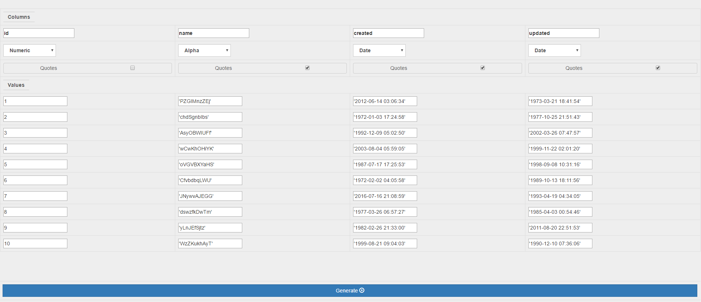
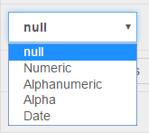
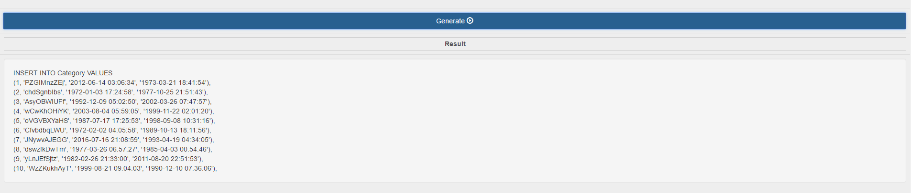

# SQL Insert Generator
This is a small tool to generate simple &amp; fast sql insert statements for your database
It is useful for testing. It is possible to generate random data or specify own input.

* It's optimized for MySQL-Syntax. Maybe there will be support for more dbms in the future
* the implementation is quick and dirty. Maybe it will be tidied up in the future
* I have ideas to improve the tool in the future:
  * Random Numeric values
  * Specify min and max values for numerics
  * Specify start value for numerics
  * Specify min and max values for dates
  * Generate random strings (like names) based on specific sources
  * Specify min and max string lengths
  * Insert a copy button to copy statements to the clipboard
  * Support update statements
  * Determine the column names from csv-input or create statement
  * Option to choose between single and multiple insert statements

## Usage

1. Define the table name

2. Define the column count and click "Apply"

3. Define the line count and click "Apply"

4. Now youcan type in the column names, choose the type and if the value should be surrounded with quotes

5. There are currently 4 options to select. Null is the default selection.

6. Click the "Generate" - Button and you will get your statements

